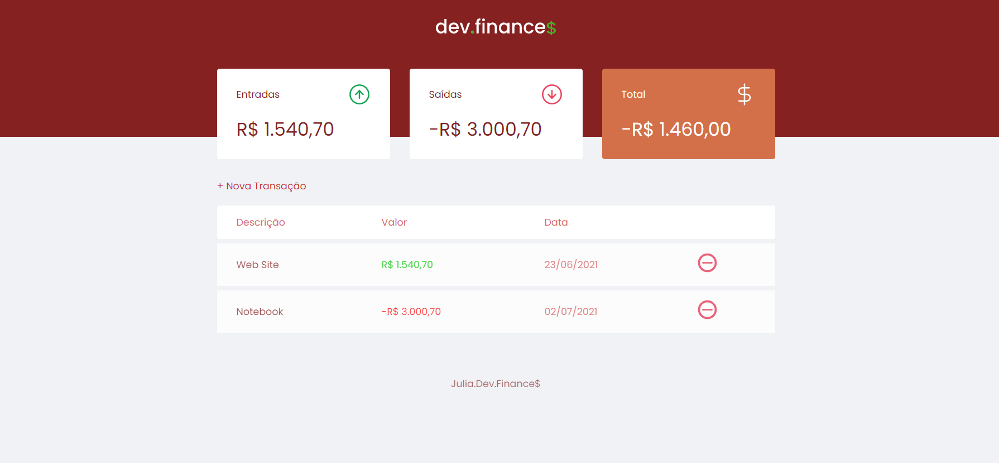

# WEB_FINANCE 💸

## Sumário

1. [Objetivos](#objetivos)
2. [Demonstração](#demonstração)
3. [Ferramentas](#ferramentas)
4. [Dev](#dev)

-----

## Objetivos

O objetivo dessa construção foi praticar melhor o meu conhecimento em construção de WebSites com ferramentas Front-End. 
Com o Discover da RocketSeat, encontrei maneiras melhores para trabalhar com responsividade e com comandos do JavaScript.  
Foram longas aulas para a construção dessa aplicação.

----

## Demonstração

----

## Ferramentas

* HTML
* CSS
* JAVASCRIPT
* LOCASTORAGE

----

## DEV

* Júlia De Melo Albuquerque  
 

